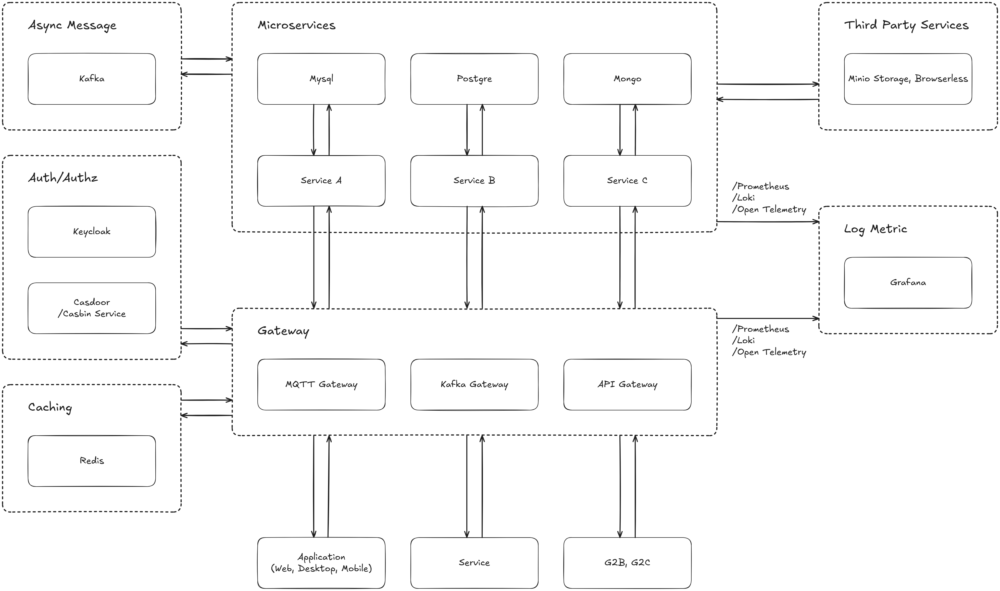

# Digital Transformation Documentation - Core Design Document – Microservice Architecture Principles

Welcome to the Digital Transformation project! This repository contains comprehensive documentation, guides, and resources to support the development, deployment, and maintenance of digital transformation initiatives.

All name concern as Digital Transformation (dt)

## Overview
Our goal is to streamline business processes, enhance user experiences, and drive innovation through modern digital solutions. This documentation will help stakeholders, developers, and users understand the project's architecture, features, and best practices.

This document defines the **core architecture, design standards, and operational principles** for all microservices in this system.  
It acts as the **main reference** for engineers, DevOps, and architects to ensure consistency, scalability, and maintainability across services.

---
## Architecture

---

## 1. Vision and Goals

Our mission is to build a **resilient, scalable, observable, and secure distributed system** based on independently deployable microservices.

**Goals:**
- Empower teams to work autonomously.
- Ensure system reliability through resilient design.
- Simplify debugging via observability and tracing.
- Maintain security by design.
- Enable continuous development through clear governance.

---

## 2. Core Architectural Principles

| Principle | Description |
|------------|-------------|
| **Autonomy** | Each microservice is independently deployable and versioned. |
| **Resilience** | Handle failures gracefully with retries, fallbacks, and circuit breakers. |
| **Observability** | Every service must expose metrics, logs, and traces. |
| **Security First** | Authentication and authorization are mandatory at every layer. |
| **API-First Design** | Define contracts before implementation (OpenAPI / gRPC). |
| **Infrastructure as Code** | Environments are fully reproducible (Terraform, Helm). |
| **Evolutionary Architecture** | Architecture evolves through documented ADRs. |

---

## 3. System Overview

- Services are designed following **Domain-Driven Design (DDD)**.
- Communication patterns:
  - **Synchronous:** REST or gRPC with circuit breaker and retry.
  - **Asynchronous:** Kafka / Redis Streams for event-driven messaging.
- Each service is containerized (Docker) and orchestrated via Docker/Kubernetes.

---

## 4. Service Design Pattern

### 4.1 Service Directory Template
need to input
### 4.2 Required Components
- **API Layer:** REST/gRPC endpoints.
- **Domain Logic:** Core business rules.
- **Persistence Layer:** Database integration.
- **Configuration:** Environment variables only.
- **Observability:** Logging, tracing, metrics.
- **Healthcheck:** `/health` and `/ready` endpoints.

---

## 5. Communication Patterns

### 5.1 Synchronous
- Use **gRPC** or REST for internal service communication.
- Always define **timeout, retry, and circuit breaker** policies.
- Maintain **backward compatibility** for all API changes.

### 5.2 Asynchronous
- Use **Kafka** or **Redis Streams** for event-based messaging.
- Events must be **idempotent** and **versioned**.
- All published events are documented under `/docs/api/event-schemas/`.

---

## 6. Security and Compliance

- Centralized **Authentication** via Keycloak or OIDC provider.  
- Fine-grained **Authorization** using Casbin / ABAC / RBAC.
- Use **JWT tokens** for inter-service access.
- Secrets are managed in **Vault** or **AWS Secrets Manager**.
- All internal traffic uses **mTLS** or encrypted channels.

---

## 7. Observability Standards

Every service must implement:
- **Metrics:** Expose via Prometheus (`/metrics` endpoint).
- **Logging:** Structured JSON logs with `trace_id`, `span_id`.
- **Tracing:** OpenTelemetry instrumentation.
- **Dashboards:** Grafana panels per service.

---

## 8. DevOps & Deployment Lifecycle

- **CI/CD Pipelines:** Automated build, test, and deploy per commit.
- **Infrastructure as Code:** Terraform, Helm, or Ansible.
- **Environment Flow:** Dev → Staging → Production.
- **Deployment Strategies:** Blue/Green or Rolling updates.
- **Scalability:** Use Kubernetes HPA or KEDA for autoscaling.

---

## 9. Data Management

- Each microservice **owns its own database schema**.
- No direct cross-service DB access.
- All schema changes are version-controlled (Flyway, Liquibase, Prisma).
- Daily **backups** and **retention policies** per service.
- **Data access only via API or events.**

---

## 10. Testing Standards

| Test Type | Framework | Requirement |
|------------|------------|-------------|
| Unit Tests | Jest / JUnit / Go test | ≥80% coverage |
| Integration Tests | Postman / Supertest | Required |
| Contract Tests | Pact | Required for consumer-provider relationships |
| E2E Tests | Cypress / Playwright | At least one per user flow |
| Load Tests | k6 / Locust | SLA validation |
| Chaos Tests | Litmus / Gremlin | Optional but encouraged |

---

## 11. Governance & Standards

### 11.1 Code Standards
- Follow project-specific linting and formatting.
- Code review is **mandatory** before merging.

### 11.2 API Standards
- Define API via OpenAPI spec.
- Use consistent naming, pagination, and error models.

### 11.3 Versioning
- Semantic Versioning (`v1.2.0`).
- Maintain backward compatibility for one major version.

### 11.4 ADR (Architecture Decision Records)
- Major design changes are recorded under `/docs/adr/`.

---

## 12. Performance & Scalability

- Design for **horizontal scalability**.
- Monitor p95 latency, throughput, and CPU/memory usage.
- Each service should define SLA and SLO metrics.

---

## 13. Incident Management

- Health endpoints: `/health`, `/ready`, `/metrics`.
- Error logs include `trace_id` for cross-service correlation.
- Alerts configured in Prometheus → Slack / OpsGenie.
- Runbooks maintained under `/docs/operations.md`.

---

## 14. Architecture Evolution

- Use **ADRs** for all major changes.
- Regular (quarterly) **architecture reviews**.
- Maintain a **tech radar** to evaluate frameworks and dependencies.

---

## 15. References

- [Microservices Patterns – Chris Richardson](https://microservices.io/patterns/)
- [Google Cloud Architecture Framework](https://cloud.google.com/architecture/framework)
- [Netflix Engineering Blog](https://netflixtechblog.com)
- [The Twelve-Factor App](https://12factor.net)
- [OpenTelemetry](https://opentelemetry.io)
- [CNCF Cloud Native Landscape](https://landscape.cncf.io)

---
